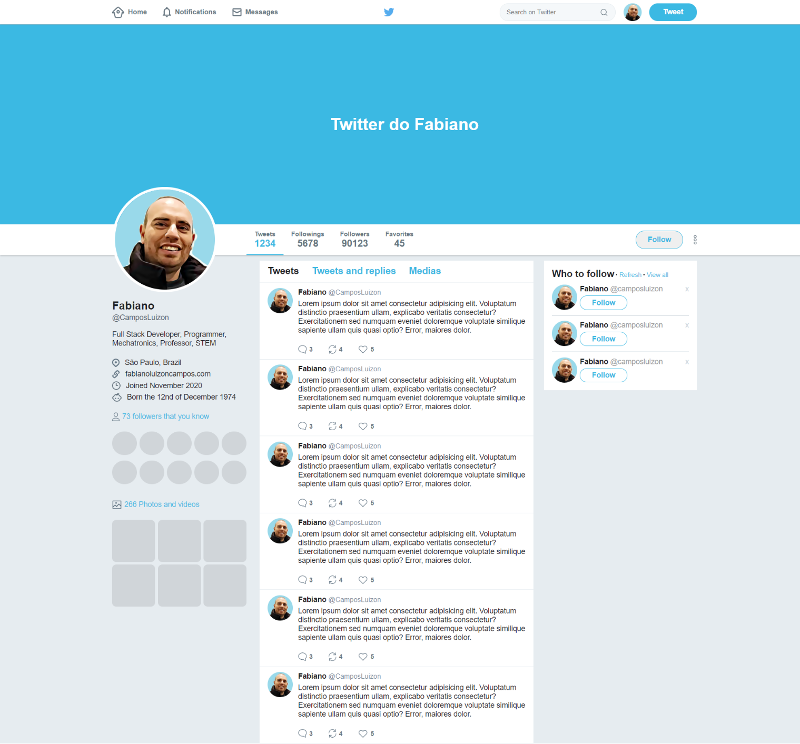

<h1 align="center">
    
</h1>

<h2 align="center">
    Fabiano Luizon Campos
</h2>

<h3 align="center">
    Software Developer
</h3>

---

https://github.com/FabianoLuizonCampos

https://github.com/FabianoLuizonCampos/ui-clone-Twitter.git

---

## 👾 About
Twitter´s UI Clone - trainning html and css with flebox layout!!!

## 🖥️ Screenshots

<h1 align="center">
    
</h1>

## Setup

1. First clone de repository - If you need help acess: https://help.github.com/pt/github/creating-cloning-and-archiving-repositories/cloning-a-repository ;
2. Open folder with your editor;
3. If you use Visual Code, you can use LiveServer plugin to open;
4. Or in browser go to `index.html`

## ✔️ Languages Used
- HTML
- CSS

## 📇 Contacts
- <a href="https://github.com/FabianoLuizonCampos" target="_blank">Github</a>
- <a href="https://www.linkedin.com/in/fabianoluizoncampos" target="_blank">LinkedIn</a>
- <a href="mailto:fabianoluizoncampos@gmail.com" target="_blank">Email</a>

